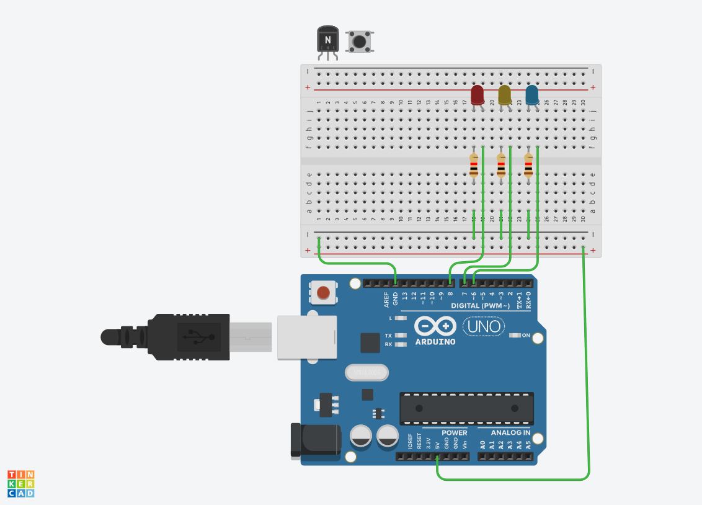

# LED 연습

## LED 깜박이기


```c
// C++ code
#define LED 8


void setup()
{
  pinMode(LED, OUTPUT);
  
}

void loop()
{
  digitalWrite(LED, HIGH);
  delay(1000); // Wait for 1000 millisecond(s)
  digitalWrite(LED, LOW);
  delay(1000); // Wait for 1000 millisecond(s)

}
```
## LED 경찰봉 구현하기


```c
// C++ code
#define LED1 8
#define LED2 7
#define LED3 6

void setup()
{
  pinMode(LED1, OUTPUT);
  pinMode(LED2, OUTPUT);
  pinMode(LED3, OUTPUT);
  
  
}

void loop()
{
  digitalWrite(LED1, HIGH);
  digitalWrite(LED2, HIGH);  
  digitalWrite(LED3, HIGH);
  
  delay(1000); // Wait for 1000 millisecond(s)
  
  digitalWrite(LED1, LOW);
  digitalWrite(LED2, LOW);
  digitalWrite(LED3, LOW);
  delay(1000); // Wait for 1000 millisecond(s)

}
```
