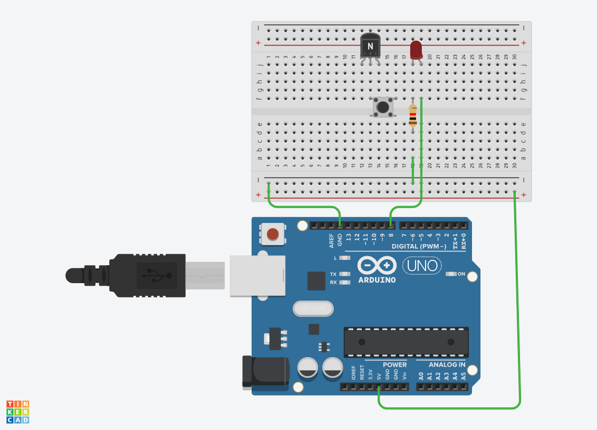
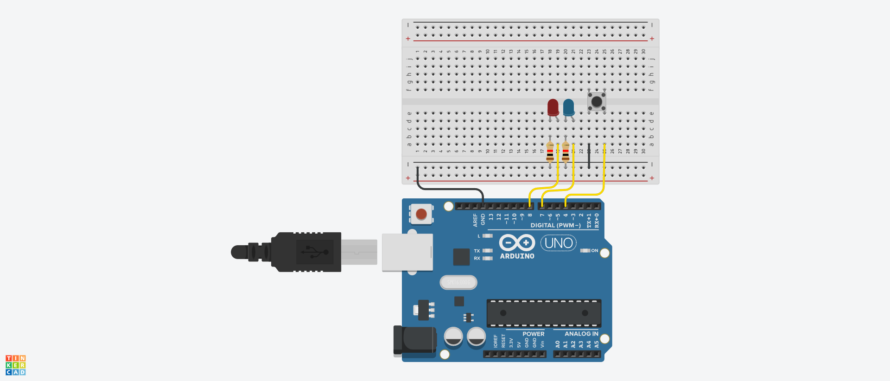

# LED 연습

## LED 깜박이기


```c
// C++ code
#define LED 8


void setup()
{
  pinMode(LED, OUTPUT);
  
}

void loop()
{
  digitalWrite(LED, HIGH);
  delay(1000); // Wait for 1000 millisecond(s)
  digitalWrite(LED, LOW);
  delay(1000); // Wait for 1000 millisecond(s)

}
```
## LED 경찰봉 구현하기


```c
// C++ code
#define LED1 8
#define LED2 7
#define LED3 6

void setup()
{
  pinMode(LED1, OUTPUT);
  pinMode(LED2, OUTPUT);
  pinMode(LED3, OUTPUT);
  
  
}

void loop()
{
  digitalWrite(LED1, HIGH);
  digitalWrite(LED2, HIGH);  
  digitalWrite(LED3, HIGH);
  
  delay(1000); // Wait for 1000 millisecond(s)
  
  digitalWrite(LED1, LOW);
  digitalWrite(LED2, LOW);
  digitalWrite(LED3, LOW);
  delay(1000); // Wait for 1000 millisecond(s)

}
```
## 버튼으로 LED 경찰봉 구현하기


```c
// C++ code
#define LED1 8
#define LED2 7
#define BUTTON 4
#define DELAY_TIME 80

int state=0;

void setup()
{
  Serial.begin(9600);
  pinMode(BUTTON,INPUT_PULLUP);
  pinMode(LED1,OUTPUT);
  pinMode(LED2,OUTPUT);
          
  
}

void loop()
{
 int buttonValue = !digitalRead(BUTTON);
  
  if(buttonValue == 1){
    state = !state;
    delay(500);
  }
  if(state == 0) {
    digitalWrite(LED1, HIGH);
    digitalWrite(LED2,LOW);
    delay(DELAY_TIME);
    digitalWrite(LED2, HIGH);
    digitalWrite(LED1,LOW);
    delay(DELAY_TIME);
  }
  else if(state == 1) {
    digitalWrite(LED1, LOW);
    digitalWrite(LED2,LOW);
  }
}
```
